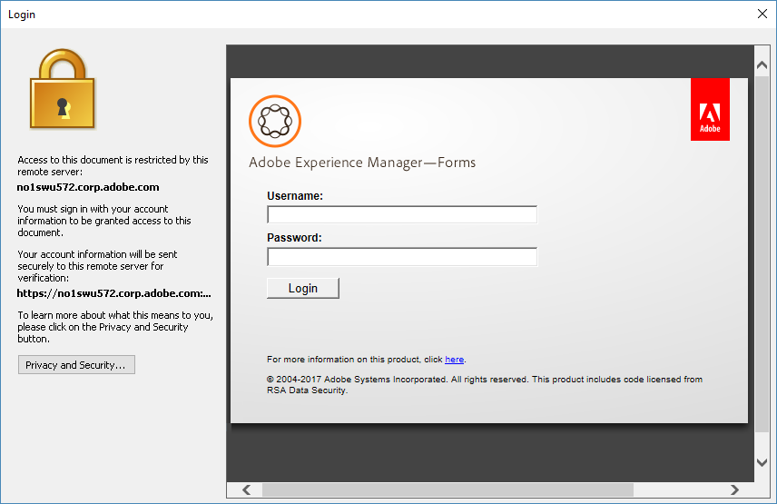

# Using AEM Document Security Extension for Microsoft Office{#using-aem-document-security-extension-for-microsoft-office}

## Protect files using AEM Document Security Extension {#usingaemdocumentsecurityextensiontoprotectfiles}

You can control how recipients use your policy-protected files, no matter how widely you distribute them.

Using Document Security Extension for Microsoft Office, you can perform these tasks:

* Configure your connection to Document Security
* Apply a policy to a file
* Open the Document Security web pages to create and manage user policies
* Remove policy protection from a file
* Change the policy that is applied to a file
* Open the Document Security web pages to revoke access to files or change the policy for the file
* Open the Document Security web pages to view the file’s audit history

### Connect to a Document Security server {#connect-to-a-document-security-server}

If you intend to apply policies to files, you must configure the connection settings for Document Security. Depending on how Document Security Extension for Microsoft Office was installed, you may already have default connection settings. You can add connection settings for one or more instances of Document Security. You can obtain server information from the Document Security administrator.

You must set the server that you want to use to protect files or manage your protected files as the default server. When you apply a policy to a new file or open the Document Security web pages, Document Security Extension for Microsoft Office connects to the default server. If you protect files using more than one instance of Document Security, you must change the default server setting when you switch between servers. You can open files that are protected by any instance of Document Security as long as you have authorization to open the file.

If your Document Security server employs certificate-based authentication, you will need to install the certificate that you received in your local machine. You will be required to choose certificate authentication, and provide the certificate that you want to use to authenticate.

After you configure the connection settings for an instance of Document Security in one Microsoft Office application, it is configured for all of Word, Excel, and PowerPoint.

#### Install the client-side certificate {#install-the-client-side-certificate}

If you are required to access the Document Security web pages through certificate authentication or two-way authentication, you will receive the certificate that you must install on your local machine. You receive a certificate file (.PFX or .P12 file) and its password.

1. Save the certificate file in your local machine.
1. Double-click the certificate file to open the Certificate Import Wizard and click **Next**.
1. Click **Next** if the certificate file is listed in the filename box. Click **Browse** if you want to locate another certificate.
1. Enter the password that you received and click **Next**.
1. On the Certificate Store dialog, select Place All Certificates In The Following Store, and click **Browse**.
1. In the Select Certificate Store dialog, select Personal, click **OK**, click **Next**, and then click **Finish**.

#### Configure connection settings {#configure-connection-settings}

1. In Document Security Extension for Microsoft Office 2010 and Office 2013, on the **Document Security** tab, select **Choose Server**.
1. Either click **New** to create new connection settings, or select an existing connection and click **Edit**.
1. Type a name for the connection in the **Name** box. You can use any name.
1. Type the address of the server in the **Server Address** box.
1. Type the server port in the **Port** box.
1. (Optional) If you want to remember your user name and password, select **Remember Password On This Computer**, and type your user name and password in the appropriate boxes. It is recommended that you do not select this option if other people may have access to the computer.
1. Click **Connect To This Server**. Document Security Extension for Microsoft Office attempts to connect to the server you specified. Depending on the authentication type specified, do one of the following:

   **Username and Password**

   Enter the username and password that you received from the Document Security administrator.

   **Certificate Authentication**

   Choose this option to select the certificate that you received and installed in your personal certificate store.

   If only one authentication type is configured on Document Security, only that option appears.

>[!NOTE]
>
>If you cannot connect to the server, try to open the Document Security web pages in Internet Explorer. If you cannot connect to the server using Internet Explorer or if a dialog box displays a warning about the server certificate, Document Security Extension for Microsoft Office cannot connect to the server. Contact the server administrator for assistance.

>[!NOTE]
>
>If you cannot connect to Document Security, a message appears stating that “The username and password are incorrect, please check your configuration settings and try again”. This message may appear if you cannot connect for another reason. If you are connecting to the server for the first time, verify that you set the server name and port correctly.

#### Specify the default server {#specify-the-default-server}

1. Do the following:

    * In Document Security Extension for Microsoft Office 2010 and Office 2013 on the **Document Security** tab, select **Choose Server**.

1. Select a server to specify as the default and click **Set Default**. A star appears next to the default server.

### Using Third-party authentication providers {#using-third-party-authentication-providers}

You can use third-party authentication providers with AEM Forms Document Security. These authentication providers help you add an additional access layer to the protected documents. AEM Forms Document Security supports following extended authentication workflows:

* Extended authentication using default AEM Forms URL
* Extended authentication using a custom URL
* Default extended authentication workflow with third-party identity providers configured on AEM Forms on JEE server
* Custom extended authentication workflow with third-party identity providers configured on AEM Forms on JEE server
* Extended authentication using customized page for listing SAML Authentications

#### Extended authentication using default AEM Forms URL {#extended-authentication-using-default-aem-forms-url}

You can use default AEM Forms URL for extended authentication. The default landing page contains Adobe branding. Moreover, default AEM Forms settings are used on using default AEM Forms URL for extended authentication.

Perform the following steps to enable extended authentication with the default Adobe Landing URL:

1. Open AEM Forms Admin UI.
1. Navigate to Services &gt; Document Security &gt; Configuration &gt; Server Configuration.
1. Enable the Allow Extended Authentication option.
1. Specify the default URL Extended Authentication Landing URL. The default URL is http://localhost:8080/edc/extendedauthentication/welcome.jsp.

   Click **[!UICONTROL Save]**.

   >[!NOTE]
   >
   >Use a fully qualified hostname in the URL. It is recommended to use HTTPS protocol.

   Now, AEM Forms document security is configured to use extended authentication with default AEM Forms landing URL.

   

#### Extended authentication with a custom landing URL {#extended-authentication-with-a-custom-landing-url}

You can use a custom URL for extended authentication. It provides the flexibility to display a custom authentication page with custom branding. For example, branding for your organization.

You can package the custom authentication page in a war file and deploy the war file to AEM Forms server. The war file contains complete logic to accept user credentials and authenticate against the AEM Forms server. AEM Forms Document Security has the following requirements for the custom authentication page:

* The authentication page should send username as j_username and password as j_password. The page should also send the source_url and login_url as hidden parameters.
* On successful authentication, the page should close automatically.

Perform the following steps to enable extended authentication with a custom landing URL:

1. Deploy the custom authentication war file to AEM Forms server.
1. Open AEM Forms Admin UI.
1. Navigate to Services &gt; Document Security &gt; Configuration &gt; Server Configuration.
1. Enable the Allow Extended Authentication option and specify custom Extended Authentication Landing URL.
1. Add the following entries to config.xml file under the SSO node after entry *&lt;node name=“AllowedUrls“&gt;*:

   >[!NOTE]
   >
   ><entry&nbsp;key=”sso-l”&nbsp;value=”/&nbsp;sample_/login.jsp”/>!!discoiqbr!!<entry&nbsp;key=”sso-s”&nbsp;value=”/&nbsp;sample_/welcome.jsp”>!!discoiqbr!!<entry&nbsp;key=”sso-o”&nbsp;value=”/&nbsp;sample_/logout.jsp”/>!!discoiqbr!!

   For step-by-step information on updating the config.xml file, see [Manually editing the document security configuration file](https://helpx.adobe.com/aem-forms/6-3/admin-help/configuring-client-server-options.html#manually_editing_the_document_security_configuration_file).

   Now, AEM Forms document security is configured to use extended authentication with a custom landing URL

#### Default extended authentication workflow with third-party identity providers configured on AEM Forms server {#default-extended-authentication-workflow-with-third-party-identity-providers-configured-on-aem-forms-server}

Extended authentication can use different types of authentications available on AEM Forms server. For example, SAML, [What are more examples].

Note: If SAML providers are configured on AEM Forms server, then before displaying the landing URL, a page containing all the identity providers configured for SAML authentications is displayed.

The following screen is shown when a protected document is opened in Acrobat.

#### Custom extended authentication workflow when SAML providers are configured on AEM Forms server {#custom-extended-authentication-workflow-when-saml-providers-are-configured-on-aem-forms-server}

If SAML providers are configured on AEM Forms server, then before displaying the landing URL, a page containing all the identity providers configured for SAML authentications is displayed.

Perquisites to configure a custom extended authentication workflow when SAML providers are configured on AEM Forms server are:

* SAML authentications are configured on AEM Forms server
* Custom war, containing a custom authentication page and complete logic to accept user credentials and authenticate against the AEM Forms server, is deployed to AEM Forms server.

#### Using custom page for listing SAML authentications {#using-custom-page-for-listing-saml-authentications}

You can also display a custom page to include all the all the authentication providers configured on AEM Forms server. Perform the following steps to create such a page:

1. Package the custom authentication page in a war file and deploy the war file to AEM Forms server. The war file contains complete logic to accept user credentials and authenticate against the AEM Forms server.
1. Open AEM Forms Admin UI and navigate to **[!UICONTROL Settings]**> **[!UICONTROL User Management]** > **[!UICONTROL Configuration]** > **[!UICONTROL SAML Service Provider Settings]**.
1. Add the following to the Custom Properties field and click **[!UICONTROL Save]**.

   *saml.sp.discovery.url=/demoJSP/saml_discovery.jsp*

   Now, AEM Forms document security is configured to display a custom page containing all the configured authentication providers.

### Obtain a user account {#obtaining-a-user-account}

If you do not already have a Document Security account, Document Security may initiate the registration process when these events occur:

* A Document Security user who wants to send you a policy-protected file adds you to a policy.
* The Document Security administrator creates an account for you.

After you register and activate your account, you can use policy-protected files that you were given authorization to use through a policy.

>[!NOTE]
>
>If you receive a policy-protected file and do not have a Document Security account, or if you receive an invitation to register, contact the person who sent you the file for assistance.

If you receive an email registration invitation from Document Security, you can register by using the URL in the email to open the online registration page. After you register, you will receive a second notice about activating your account.

#### Obtain an external user account {#obtain-an-external-user-account}

1. Open the Document Security registration email. The URL that the message contains is a link to the Document Security External Users Registration page. If you do not receive a registration message, contact the person who sent you the file for assistance.
1. Click the URL or copy it and paste it into your browser.
1. Type your name, organization, and password in the appropriate boxes. Your password can be any combination of eight characters.

   >[!NOTE]
   >
   >Ensure that you choose a password that is easy to remember; no method is available for finding forgotten passwords.

1. Click **Register**. A message appears informing you to check your email for an activation email message.
1. Open the Document Security registration confirmation email.
1. Click the URL that appears in the message.
1. Click the link to the Login page.
1. In the **Username** box, type the email address you registered under with Document Security. This email address is your default Document Security user name.
1. In the **Password** box, type the password you created when you registered.
1. Click **Login**.

### Create and manage policies {#creating-and-managing-policies}

If you have permission from the Document Security administrator, you can create policies to apply to your own files on the Policies page of the Document Security web pages.

Some of the policy settings available for creating policies in the Document Security web pages are not supported for Word, Excel, and PowerPoint files. The following tables describe how the policy permissions map to Word, Excel, and PowerPoint features.

<table cellpadding="4" cellspacing="0">
 <thead align="left">
  <tr>
   <th class="cellrowborder" id="d19e716" valign="top" width="NaN%">
Permissions
</th>
   <th class="cellrowborder" id="d19e719" valign="top" width="NaN%">
Word, Excel, and PowerPoint support
</th>
  </tr>
 </thead>
 <tbody>
  <tr>
   <td class="cellrowborder" headers="d19e716 " valign="top" width="NaN%">
Print &gt; Not Allowed
</td>
   <td class="cellrowborder" headers="d19e719 " valign="top" width="NaN%">
Printing the file is not allowed.
</td>
  </tr>
  <tr>
   <td class="cellrowborder" headers="d19e716 " valign="top" width="NaN%">
Print &gt; Allowed
</td>
   <td class="cellrowborder" headers="d19e719 " valign="top" width="NaN%">
Printing the file is allowed.

<strong>Note</strong>: <i>If a policy gives the Copy permission but not the Print permission, content copied to another file can be printed.</i>
</td>
  </tr>
  <tr>
   <td class="cellrowborder" headers="d19e716 " valign="top" width="NaN%">
Print &gt; Low Res. Only
</td>
   <td class="cellrowborder" headers="d19e719 " valign="top" width="NaN%">
Not applicable.
</td>
  </tr>
  <tr>
   <td class="cellrowborder" headers="d19e716 " valign="top" width="NaN%">
Change &gt; Any
</td>
   <td class="cellrowborder" headers="d19e719 " valign="top" width="NaN%">
The file can be changed.

When this permission is not given, you cannot modify protected Word and Excel files. You can modify PowerPoint files but cannot save the changes or view slide shows for modified files.
</td>
  </tr>
  <tr>
   <td class="cellrowborder" headers="d19e716 " valign="top" width="NaN%">
Change &gt; Not Allowed
</td>
   <td class="cellrowborder" headers="d19e719 " valign="top" width="NaN%">
Users cannot modify protected files.
</td>
  </tr>
  <tr>
   <td class="cellrowborder" headers="d19e716 " valign="top" width="NaN%">
Change &gt; Alter Pages
</td>
   <td class="cellrowborder" headers="d19e719 " valign="top" width="NaN%">
Not applicable.

Includes inserting, deleting, and rotating pages.
</td>
  </tr>
  <tr>
   <td class="cellrowborder" headers="d19e716 " valign="top" width="NaN%">
Change &gt; Fill &amp; Sign
</td>
   <td class="cellrowborder" headers="d19e719 " valign="top" width="NaN%">
Not applicable.
</td>
  </tr>
  <tr>
   <td class="cellrowborder" headers="d19e716 " valign="top" width="NaN%">
Offline
</td>
   <td class="cellrowborder" headers="d19e719 " valign="top" width="NaN%">
The file can be opened offline.
</td>
  </tr>
  <tr>
   <td class="cellrowborder" headers="d19e716 " valign="top" width="NaN%">
Copy
</td>
   <td class="cellrowborder" headers="d19e719 " valign="top" width="NaN%">
File contents can be copied to other files.
</td>
  </tr>
  <tr>
   <td class="cellrowborder" headers="d19e716 " valign="top" width="NaN%">
Screen Reader 
</td>
   <td class="cellrowborder" headers="d19e719 " valign="top" width="NaN%">
Screen readers (devices for users with vision impairment) can read the file contents.
</td>
  </tr>
  <tr>
   <td class="cellrowborder" headers="d19e716 " valign="top" width="NaN%">
Permission Validity
</td>
   <td class="cellrowborder" headers="d19e719 " valign="top" width="NaN%">
Supported.
</td>
  </tr>
 </tbody>
</table>

<table cellpadding="4" cellspacing="0">
 <thead align="left">
  <tr>
   <th class="cellrowborder" id="d19e816" valign="top" width="NaN%">
General Settings
</th>
   <th class="cellrowborder" id="d19e819" valign="top" width="NaN%">
Word, Excel, and PowerPoint support
</th>
  </tr>
 </thead>
 <tbody>
  <tr>
   <td class="cellrowborder" headers="d19e816 " valign="top" width="NaN%">
Validity period
</td>
   <td class="cellrowborder" headers="d19e819 " valign="top" width="NaN%">
Supported.
</td>
  </tr>
  <tr>
   <td class="cellrowborder" headers="d19e816 " valign="top" width="NaN%">
Audit document
</td>
   <td class="cellrowborder" headers="d19e819 " valign="top" width="NaN%">
Supported.
</td>
  </tr>
  <tr>
   <td class="cellrowborder" headers="d19e816 " valign="top" width="NaN%">
Auto-Offline lease period
</td>
   <td class="cellrowborder" headers="d19e819 " valign="top" width="NaN%">
Supported.
</td>
  </tr>
  <tr>
   <td class="cellrowborder" headers="d19e816 " valign="top" width="NaN%">
External Authorization Providers
</td>
   <td class="cellrowborder" headers="d19e819 " valign="top" width="NaN%">
Supported.
</td>
  </tr>
 </tbody>
</table>

<table cellpadding="4" cellspacing="0">
 <thead align="left">
  <tr>
   <th class="cellrowborder" id="d19e857" valign="top" width="NaN%">
Advanced Settings
</th>
   <th class="cellrowborder" id="d19e860" valign="top" width="NaN%">
Word, Excel, and PowerPoint support
</th>
  </tr>
 </thead>
 <tbody>
  <tr>
   <td class="cellrowborder" headers="d19e857 " valign="top" width="NaN%">
Dynamic watermarks
</td>
   <td class="cellrowborder" headers="d19e860 " valign="top" width="NaN%">
Supported.
</td>
  </tr>
  <tr>
   <td class="cellrowborder" headers="d19e857 " valign="top" width="NaN%">
Certification Plug-ins
</td>
   <td class="cellrowborder" headers="d19e860 " valign="top" width="NaN%">
Not applicable.
</td>
  </tr>
  <tr>
   <td class="cellrowborder" headers="d19e857 " valign="top" width="NaN%">
Encryption algorithm and key length 
</td>
   <td class="cellrowborder" headers="d19e860 " valign="top" width="NaN%">
All options are supported.
</td>
  </tr>
  <tr>
   <td class="cellrowborder" headers="d19e857 " valign="top" width="NaN%">
Document restriction
</td>
   <td class="cellrowborder" headers="d19e860 " valign="top" width="NaN%">
All file contents are always encrypted regardless of the setting in the policy.
</td>
  </tr>
  <tr>
   <td class="cellrowborder" headers="d19e857 " valign="top" width="NaN%">
Access-denied error message
</td>
   <td class="cellrowborder" headers="d19e860 " valign="top" width="NaN%">
Supported.
</td>
  </tr>
 </tbody>
</table>

For more information about creating and managing policies, see [Document Security End User Help](http://help.adobe.com/en_US/AEMForms/6.1/RMHelp/).

### Apply policies {#applying-policies}

You can apply any available policy to a file, including policies that you created and those that are part of policy sets that you have access to. Before applying a policy, you must save the file.

After you apply a policy, it is added to the Recently Used list on the AEM Document Security menu to make it easier for you to apply your most frequently used policies. If you use more than one instance of Document Security, the Recently Used list displays the policies only for the server you are currently connected to or for your default server if you have not yet logged in to an instance of Document Security.

>[!NOTE]
>
>You can apply policies only to Word document files (.doc, also.docx and .docm in Microsoft Office 2010 and 2013), Excel workbook files (.xls, also .xlsx, and .xlsm in Microsoft Office 2010 and 2013), and PowerPoint presentation files (.ppt, also .pptx, and .pptm in Microsoft Office 2010 and 2013). You cannot apply policies to Word template files (.dot), Excel template files (.xlt), and PowerPoint design template files (.pot).

#### Apply a policy {#apply-a-policy}

1. In Document Security Extension for Microsoft Office 2010 and 2013 on the **Document Security** tab, select **Secure &gt; Choose Policy**.

   If you chose user name and password as the authentication method on the server and have not yet provided login information for Document Security, a dialog box prompts for your user name and password.

1. Select a policy from the list and click **Apply**.
1. Save the file.

#### Apply a recently-used policy {#apply-a-recently-used-policy}

1. In Document Security Extension for Microsoft Office 2010 and 2013, on the **Document Security** tab, select **Secure &gt; ***[Policy Name]*.
1. Save the file.

## Work with the Policy-Protected Files {#usingaemdocumentsecurityextensionpolicyprotectedfiles}

Policy-protected files contain intellectual property that is owned by the file publisher and protected by Document Security.

You can use policy-protected files whether you are internal or external to the file publisher’s organization. To open policy-protected files, you must be recognized by Document Security, either through inclusion in a linked LDAP or Active Directory list, being added as a local user for LiveCycle or AEM forms on JEE, or by registering with Document Security after being invited as a user.

If you receive a policy-protected file and do not have a Document Security account, or if you receive an invitation to register, contact the person who sent you the file for assistance.

### Working with policy-protected files in Microsoft Office {#working-with-policy-protected-files-in-microsoft-office}

Document Security Extension for Microsoft Office restricts certain Word, Excel, and PowerPoint functionality to protect the file publisher’s intellectual property. If you do not have permission to change the file, you cannot save modifications to it.

If you are working with a policy-protected file, some product features may not be available or may not work as usual. If you also have an unprotected file open, most features are enabled for the unprotected file, except those that allow you to import or copy content from a policy-protected file for which you do not have copy or export permissions.

>[!NOTE]
>
>When using Document Security Extension-supported Office applications, it is recommended that you disable the Windows DEP setting. Also, to ensure that Office applications start smoothly on a machine that has Document Security Extension installed and McAfee VirusScan with On-Access Scan enabled, disable the Buffer Overflow Protection option in the McAfee VirusScan Console.

If a feature is not available, the command name on the menu and the related toolbar button are unavailable. In Document Security Extension for Microsoft Office, when you hover the mouse pointer over the command or button, a tool tip indicates that the command is made unavailable by Document Security.

### Opening policy-protected files {#opening-policy-protected-files}

You can open policy-protected files by using the same methods that you use to open any other file. If you are not already logged in to Document Security, you are prompted to do so unless you are not connected to the Internet and you can open the file offline. If you cancel the login process, access is denied.

If you do not have permission to open the file, you are informed that access is denied. If the file access privileges were revoked, you may also be directed to an updated version of the file if one is available. For additional assistance if you cannot open a policy-protected file, contact the file publisher.

When a protected file is open, text in the title bar that follows the file name states that the file is protected by AEM Document Security.

When opening a protected document in Document Security Extension for Microsoft Office from SharePoint Server, ensure the Microsoft Office program associated with the file type, such as Microsoft Word, Microsoft Excel, or Microsoft PowerPoint, is open. If you try to open the file without opening the associated application, the document may not open and an error message indicating that you must install the applicable plug-in is displayed. In addition to opening the required application, it is recommended that you clear the cache folder before opening a protected document in Document Security Extension for Microsoft Office from SharePoint Server. Also, when you open a protected document from SharePoint Server, all permissions on the document are disabled, regardless of the policy that was applied.

Depending on the authentication method implemented on Document Security, you may be prompted to choose the authentication method when you open a protected document. If Document Security supports more than one authentication method, the authentication options are presented to you. For example, if Document Security server provides both username/password and certificate authentication, you can choose the appropriate authentication method. If Certificate-based authentication enabled, you are prompted to use the certificate that you have received and installed.

The user experience when opening protected files depends on the mutual authentication configuration on the server. If only one valid client certificate is installed, then no authentication dialog appears and files opens successfully. However, if multiple client certificates are installed on a machine, then an authentication dialog appears. The user has to choose a valid certificate to open the protected file.

### Removing policy protection from a file {#removing-policy-protection-from-a-file}

If you are permitted, you can remove policy protection from files that you have protected. If you do so, the file is no longer protected by Document Security.

1. In Document Security Extension for Microsoft Office 2010 and 2013, on the **Document Security** tab, select **Remove**.

   If you have not yet provided login information for Document Security, a dialog box prompts for your user name and password.

>[!NOTE]
>
>If you cannot remove a policy from a file that you have protected, contact a Document Security administrator.

### Viewing security settings {#viewing-security-settings}

You can view the permissions that you have for the current file for printing, copying from, changing, and accessing offline, along with the file validity period.

In Document Security Extension for Microsoft Office 2010, the Security Status group on the Document Security tab displays your permissions for the file.

Do the following:

* In Document Security Extension for Microsoft Office 2010 and 2013, on the **Document Security tab**, in the **Security Status** group, click any item.

### Saving documents when Auto-apply policy is enabled {#saving-documents-when-auto-apply-policy-is-enabled}

If your Administrator has enabled the Auto-apply policy functionality, any document you create or edit will be automatically protected when you save the document.

If Auto-apply policy is enabled, Document Security Extension for Microsoft Office will prompt you to log in to the Document Security server. You will need to provide your Username and Password in order to be authenticated by the server. If you have provided the correct log-in credentials, the document will be saved and protected.

>[!NOTE]
>
>If you cannot log in to Document Security, the document may or may not be saved. This depends on how your Administrator has configured the Auto-apply policy. Check with the Administrator about how documents are handled in this situation.

### Synchronizing for offline access {#synchronizing-for-offline-access}

Policies can allow you to open files while you are offline and not connected to Document Security. You must have previously logged in to Document Security to establish your credentials with the server before you can work offline. If you plan to work with files offline, it is recommended that you synchronize with Document Security before you disconnect to ensure that the policy settings for your files are up to date with the server. It is recommended that you also open the file online once before you open it offline. If you do not open the file once online or synchronize with the server, you may still be able to use policy-protected files while offline. However, the offline lease period must not have expired, and the policy settings for the file must not have changed since you last synchronized manually or automatically with the server.

Do the following:

* In Document Security Extension for Microsoft Office 2010 and 2013, on the **Document Security** tab, select **Synchronize Off-line**.

  ***note**: The Synchronize Off-Line button is available even though the user does not have offline permission for the document. However, selecting the button does nothing. *

### Working with dynamic watermarks {#working-with-dynamic-watermarks}

Document Security Extension for Microsoft Office supports the inclusion of dynamic text-based watermarks in policy-protected documents. A dynamic watermark can include information that may change, such as the date, time, user name, or name of the policy. If a user prints a policy-protected file, and that file contains a dynamic watermark and the permission to print, the watermark appears in the output.

Document Security Extension does not support rich watermark features such as PDF-based watermarks, multiple elements in a watermark, text formatting options, and page range.

You create a dynamic watermark using the Document Security web pages. For more information about creating and including dynamic watermarks in a policy protected document, see [Document Security End User Help](http://www.adobe.com/go/learn_lc_euRightsMgmt_11).

Document Security Extension for Microsoft Office provides support for these watermark features:

<table cellpadding="4" cellspacing="0">
 <thead align="left">
  <tr>
   <th class="cellrowborder" id="d19e943" valign="top" width="NaN%">
Document Security watermark options
</th>
   <th class="cellrowborder" id="d19e946" valign="top" width="NaN%">
Word, Excel, and PowerPoint support
</th>
  </tr>
 </thead>
 <tbody>
  <tr>
   <td class="cellrowborder" headers="d19e943 " valign="top" width="NaN%">
Policy name
</td>
   <td class="cellrowborder" headers="d19e946 " valign="top" width="NaN%">
Supported.
</td>
  </tr>
  <tr>
   <td class="cellrowborder" headers="d19e943 " valign="top" width="NaN%">
Watermark name
</td>
   <td class="cellrowborder" headers="d19e946 " valign="top" width="NaN%">
Supported.
</td>
  </tr>
  <tr>
   <td class="cellrowborder" headers="d19e943 " valign="top" width="NaN%">
Use as background
</td>
   <td class="cellrowborder" headers="d19e946 " valign="top" width="NaN%">
The display behavior of a dynamic watermark is the same regardless of whether you select Use As Background.

For Word 2010 and 2013 dynamic watermark appears only in Print Layout and Print Preview view. 

For Excel 2010 and 2013 also , it appears in the Print Preview and Page Layout views.
</td>
  </tr>
  <tr>
   <td class="cellrowborder" headers="d19e943 " valign="top" width="NaN%">
Vertical position
</td>
   <td class="cellrowborder" headers="d19e946 " valign="top" width="NaN%">
Supported
</td>
  </tr>
  <tr>
   <td class="cellrowborder" headers="d19e943 " valign="top" width="NaN%">
Horizontal position
</td>
   <td class="cellrowborder" headers="d19e946 " valign="top" width="NaN%">
Supported

For Excel 2010 and 2013, the horizontal positioning of watermarks using points does not work.
</td>
  </tr>
  <tr>
   <td class="cellrowborder" headers="d19e943 " valign="top" width="NaN%">
Scale
</td>
   <td class="cellrowborder" headers="d19e946 " valign="top" width="NaN%">
Supported
</td>
  </tr>
  <tr>
   <td class="cellrowborder" headers="d19e943 " valign="top" width="NaN%">
Position
</td>
   <td class="cellrowborder" headers="d19e946 " valign="top" width="NaN%">
Supported
</td>
  </tr>
  <tr>
   <td class="cellrowborder" headers="d19e943 " valign="top" width="NaN%">
Opacity
</td>
   <td class="cellrowborder" headers="d19e946 " valign="top" width="NaN%">
Supported
</td>
  </tr>
 </tbody>
</table>

### Opening the Document Security web pages {#opening-the-document-security-web-pages}

You can open the Document Security web pages to create and update your user policies and to view status and audit information about your policy-protected files. You can also use the Document Security web pages to change policies or revoke access for a policy-protected file.

To open the Document Security web pages, in Document Security Extension for Microsoft Office 2010 and 2013, on the **Document Security** tab, select **Create and Manage Policies**. If you have not yet provided login information, the browser opens to the server login page.

### Changing policies {#changing-policies}

If you have permissions, usually as a Document Security administrator or the file publisher, you can later apply a different policy to a file or change the settings of the currently applied policy.

To change the settings for a policy, use the Document Security web pages.

1. Do the following:

    * In Document Security Extension for Microsoft Office 2010 or 2013, on the **Document Security** tab, select **Secure &gt; Change Security**.

1. Select a policy from the list and click **Apply**.

### Revoking file access privileges {#revoking-file-access-privileges}

You can revoke the ability to open files that you protected. When you revoke access privileges for a file, you can also specify the message that appears to anyone who tries to open the file, and the URL to an updated version of the file if you are replacing it with a revised copy.

1. Do the following:

    * In Document Security Extension for Microsoft Office 2010 and 2013, on the **Document Security** tab, select **Revoke**.

   The Document Security web pages open to the Revoke Documents page.

1. Specify a message to display and, if available, a URL for the updated version, and click **OK**.

For more information about revoking file access privileges, see [Document Security End User Help](http://help.adobe.com/en_US/AEMForms/6.1/RMHelp/).

Access privileges can be reinstated through the Document Security web pages.

### Viewing the file audit history {#viewing-the-file-audit-history}

Document Security can save audit history for policy-protected files so that you can audit the actions that users perform on your files.

Audited events for Word, Excel, and PowerPoint files include these:

**Secure a New Document** Policy applied to a file

**View Document** File opened

**Close Document** File closed

**Revoke Document** Access privileges removed for file

**Unrevoke Document** Access privileges returned to file

**Modify Document** File changed and saved locally

**Print High Resolution** File printed

**Change Security Handler** Policy protection removed from file

**Switch Policy on Document** New policy applied to file from the Document Security web pages

### View the audit history for a file {#view-the-audit-history-for-a-file}

In Document Security Extension for Microsoft Office 2010 and 2013, on the **Document Security** tab, select **Audit History**.

The Document Security web pages open to the Events page, which displays audited events for the current file.

### Microsoft Office restricted features {#microsoft-office-restricted-features}

To protect your intellectual property, some Microsoft Office features are unavailable when a policy-protected file is open. The list of unavailable features depends on the permissions that are granted to the current user. Some features are unavailable only for a protected file, and others are unavailable for all files when you are in a protected session. Generally, you are in a protected session from the time you open a policy-protected file until you close the application or the session expires.

Most policies grant full permissions to the file publisher. Other users may notice additional feature restrictions.

If a command is unavailable, the command name in the menu and the related toolbar button are grayed out.

>[!NOTE]
>
>Applying a policy to a file that contains a link to an embedded file does not apply the policy to the linked file. Document Security for Microsoft Office does not extend protection to linked files.

* Policy-protected Word, Excel, and PowerPoint files are blocked from opening within an Internet Explorer browser window.
* Users who were granted only the Change permission cannot copy content to a file from another application by using the Windows Clipboard. Users can copy content to files by enabling the Microsoft Office Clipboard option.
* Opening a policy-protected file in Microsoft Office makes the Print Screen key unavailable until you close the application or the session expires.
* Document Security for Microsoft Office does not support Web-based Distributed Authoring and Versioning (WebDAV). In most cases, you cannot open a policy-protected file from a WebDAV folder. If you can open a policy-protected file, you have no permissions to save, print, change, or copy from the file.

General security that apply to policy-protected files include the following restrictions:

Many common features may be restricted in Word, Excel, and PowerPoint during a protected session.

If a policy-protected file that does not allow the user to make changes is open, commands that change the file in any way are unavailable. Only the commands that open or create new documents and change the application preferences are available.

#### Word 2010 and Word 2013 restrictions {#word-2010-and-word-2013-restrictions}

Opening a policy-protected file in Word makes the saving of automatic file-recovery information unavailable until you close and restart Word. In addition, the features listed below are restricted in the described situations:

**File &gt; New &gt; New From Existing** Available but files created using this command while any policy-protected file is open cannot be saved. Content in the new file cannot be copied to another file.

**File &gt; Save** Restricted by the Change permission.

**File &gt; Save As** All options restricted by the Change permission.

**File &gt; Print** All options restricted by the Printing permission. Unavailable unless the policy allows High Resolution printing.

**File &gt; Save &amp; Send** All options unavailable during a protected session.

**File &gt; Info &gt; Protect Document &gt; Encrypt with&#xA;Password, Add Digital Signature, Mark as Final, Restrict Permission&#xA;by People** Unavailable during a protected session.

**File &gt; Workflows** Unavailable during a protected session.

***note**: The ability to start a workflow from the 2010 Microsoft Office system versions of Word, Excel, and PowerPoint is available only in the Office Professional Plus 2010, Office Enterprise 2010, and Office Ultimate 2010 suites, as well as in the stand-alone 2010 Office release versions of these programs.*

**Blog Post &gt; Publish** Unavailable during a protected session.

**File &gt; Server &gt; File Server Tasks Menu** Unavailable during a protected session.

**Home &gt; Clipboard &gt; Copy** Restricted by the Copy permission. If copying is not allowed, copied content cannot be pasted into any other file or to the Office Clipboard. Content can be copied within the protected file if the user has the change permission.

**Home &gt; Clipboard &gt; Paste** Restricted by the Change permission.

**Home &gt; Clipboard &gt; Paste Special** Restricted by the Change permission.

**Insert &gt; Text &gt; Object** Unavailable during a protected session. Policy-protected files cannot be inserted at any time.

**Mailings** Most options on this tab are unavailable during a protected session.

**Review &gt; Proofing &gt; Research** Restricted by the Copy permission. Unavailable if copying is not allowed.

**Review &gt; Proofing &gt; Thesaurus** Restricted by the Copy permission. Unavailable if copying is not allowed.

**Review &gt; Language &gt; Translate &gt; Translate&#xA;Document** Enabled with the Copy permission.

**Review &gt; Language &gt; Translate &gt; Translate&#xA;Selected Text** Enabled with the Copy permission.

**Review &gt; Language &gt; Translate &gt; Mini Translator** Enabled with the Copy permission.

**Review &gt; Compare &gt; Compare** Unavailable during a protected session. Policy-protected files cannot be compared at any time.

**Review &gt; Protect &gt; Block Authors** Unavailable during a protected session.

**Review &gt; Protect &gt; Restrict Editing** Unavailable during a protected session.

**View &gt; Macros** Some macros are restricted by the Copy permission and are unavailable unless copying is allowed.

**Add-ins** Cannot be added or removed during a protected session.

**Online Collaboration** Unavailable during a protected session.

**Master and subdocuments** Subdocuments are governed by the master documents policy when opened within the master document. If opened separately, sub documents cannot be printed, copied from, or modified.

**Resummarize** Unavailable during a protected session.

**Frames (and all related commands)** Unavailable during a protected session.

**Document Panel** Unavailable during a protected session.

**Developer &gt; Document Template** Unavailable during a protected session. To can access this command, select File > Options > Customize > Developer Tab > Templates > Document Template.

**Outlining &gt; Master Document &gt; Create Subdocument,&#xA;Insert Subdocument** Unavailable during a protected session.

#### Excel 2010 and Excel 2013 restrictions {#excel-2010-and-excel-2013-restrictions}

The features listed below are restricted in the described situations:

**File &gt; New &gt; New From Existing** Available, but files created using this command during a protected session cannot be saved. Content in the new file cannot be copied to another file.

**File &gt; Save, Save As** Restricted by the Change permission.

**File &gt; Save As &gt; PDF** Unavailable during a protected session.

**File &gt; Print** Restricted by the Printing permission. Unavailable unless the policy allows High Resolution printing.

**File &gt; Info &gt; Protect Document** Unavailable during a protected session.

**File &gt; Info &gt; Protect Workbook** Unavailable during a protected session.

**File &gt; Save &amp; Send** Unavailable during a protected session.

**File &gt; Options &gt; Add-ins** Cannot be added or removed during a protected session.

**File &gt; Workflows** Unavailable during a protected session.

***note**: The ability to start a workflow from the 2010 Microsoft Office system versions of Word, Excel, and PowerPoint is available only in the Office Professional Plus 2010, Office Enterprise 2010, and Office Ultimate 2010 suites, as well as in the stand-alone 2010 Office release versions of these programs.*

**File &gt; Server &gt; File Server Tasks Menu** Unavailable during a protected session.

**Home &gt; Clipboard &gt; Copy** Restricted by the Copy permission. If copying is not allowed, copied content cannot be pasted into any other file or to the Microsoft Office Clipboard. Content can be copied within the protected file if the user has the change permission.

**Home &gt; Clipboard &gt; Paste** Restricted by the Change permission.

**Home &gt; Clipboard &gt; Paste Special** Restricted by the Change permission.

**Home &gt; Cells &gt; Format &gt; Move or Copy Sheet** Unavailable during a protected session.

**Home &gt; Cells &gt; Insert &gt; Insert Sheet** Unavailable during a protected session.

**Home &gt; Cells &gt; Delete &gt; Delete Sheet** Unavailable during a protected session.

**Home &gt; Editing &gt; Fill &gt; Across Worksheet** Restricted by the Change permission.

**Insert &gt; Tables &gt; Table** Restricted by the Change permission.

**Insert &gt; Tables &gt; PivotTable** Policy-protected files cannot be selected in the Creation Wizard.

**Insert &gt; Text &gt; Object** Unavailable during a protected session. Policy-protected files cannot be inserted at any time.

**Insert &gt; Text &gt; Header and Footer** Restricted by the Change permission. Unavailable for a policy-protected document.

**Data &gt; Get External Data** Data from policy-protected files cannot be imported.

**Data &gt;Outline &gt; Subtotals** Restricted by the Change permission.

**Data &gt; Data Tools &gt; Data Validation** Restricted by the Change permission.

**Review &gt; Proofing &gt; Research** Restricted by the Copy permission.

**Review &gt; Proofing &gt; Thesaurus** Restricted by the Copy permission.

**Review &gt; Language &gt; Translate** Restricted by the Copy permission.

**Review &gt; Changes &gt; Protect Sheet** Unavailable during a protected session.

**Review &gt; Changes &gt; Protect Workbook** Unavailable during a protected session.

**Review &gt; Changes &gt; Share Workbook** Unavailable during a protected session.

**Review &gt; Changes &gt; Protect and Share Workbook** Unavailable during a protected session.

**Review &gt; Changes &gt; Allow Users to Edit Ranges** Unavailable during a protected session.

**Review &gt; Changes &gt; Track Changes &gt; Highlight&#xA;Changes** Unavailable for a policy-protected file that contains a dynamic watermark.

**View &gt; Macros** Restricted by the Change permission.

**View &gt; Save Workspace** Command does not work.

**Developer &gt; XML &gt; Expansion Packs** Some macros are restricted by the Copy permission and are unavailable unless copying is allowed.

**Formulas &gt; Formula Auditing &gt; Error Checking** Restricted by the Change permission. Unavailable unless changing is allowed.

**Online Collaboration** Unavailable during a protected session.

**Save Auto Recover Info** Unavailable during a protected session.

***Note**: If you attempt to change a cell in a policy-protected file for which you do not have permissions to make changes, Excel displays an incorrect warning message indicating that you must remove protection from the file by using the Unprotect Sheet command. Using the Unprotect Sheet command does not remove policy protection from the file.*

#### PowerPoint 2010 and PowerPoint 2013 restrictions {#powerpoint-2010-and-powerpoint-2013-restrictions}

The features listed below are restricted in the described situations:

**File &gt; New &gt; New From Existing** Available, but files created using this command during a protected session cannot be saved. Content in the new file cannot be copied to another file.

**File &gt; Save** Restricted by the Change permission.

**File &gt; Save As** All options restricted by the Change permission.

**File &gt; Print** All options restricted by the Printing permission. Unavailable unless the policy allows High Resolution printing.

**File &gt; Save &amp; Send** Unavailable during a protected session.

**File &gt; Info &gt; Protect Presentation &gt; Encrypt&#xA;with Password, Add a Digital Signature, Mark as Final, Restrict&#xA;Permission by People** Unavailable during a protected session.

**File &gt; PowerPoint Options &gt; Save Auto Recover&#xA;Info** Unavailable during a protected session.

**File &gt; Server &gt; File Server Tasks Menu** Unavailable during a protected session.

**Home &gt; Clipboard &gt; Copy** Restricted by the Copy permission. If copying is not permitted, copied content cannot be pasted within the document, into any other file, or to the Office Clipboard. Content can be copied within the protected file if the user has the change permission.

**Home &gt; Clipboard &gt; Paste** Restricted by the Change permission. If copying is not permitted, copied content cannot be pasted within the document.

**Home &gt; Clipboard &gt; Paste Special** Restricted by the Change permission.

**Home &gt; Slides &gt; New Slides &gt; Slides from Outline,&#xA;Reuse Slides** Unavailable during a protected session.

**Insert &gt; Text &gt; Object** Unavailable during a protected session. Policy-protected files cannot be inserted at any time.

**Design &gt; Background &gt; Background Styles, Hide&#xA;Background Graphics, Format Background** Unavailable for a policy-protected file that contains a dynamic watermark.

**Slide Show &gt; Set Up &gt; Record Slide Show** Restricted by change permission .

**Review &gt; Proofing &gt; Thesaurus** Restricted by the Copy permission.

**Review &gt; Language &gt; Translate** Restricted by the Copy permission.

**Review &gt; Language &gt; Translate &gt; Mini Translator** Enabled with the Copy permission.

**View &gt; Presentation Views &gt; Slide Show** Restricted by the Change permission. If changes are not permitted, slide shows cannot be viewed if the file was modified.

**View &gt; Macros** Some macros are restricted by the Copy permission and are unavailable unless copying is allowed.

**Add-ins** Cannot be added or removed during a protected session.

**Online Collaboration** Unavailable during a protected session.

## Use third-party authentication providers {#use-third-party-authentication-providers}

You can use third-party authentication providers with AEM Forms Document Security. These authentication providers help you add an additional access layer to the protected documents. AEM Forms Document Security supports following extended authentication workflows:

* Extended authentication using default AEM Forms URL
* Extended authentication using a custom URL
* Default extended authentication workflow with third-party identity providers configured on AEM Forms on JEE server
* Custom extended authentication workflow with third-party identity providers configured on AEM Forms on JEE server
* Extended authentication using customized page for listing SAML Authentications

For detailed steps to configure extended authentication workflows, see the [Extended Authentication Scenarios](http://blogs.adobe.com/livecycle/2011/12/extended-authentication-scenarios.html) article

## Glossary {#glossary}

For information about LiveCycle and AEM forms on JEE terminology, see [Glossary](http://www.adobe.com/go/learn_aemforms_designer_65).
